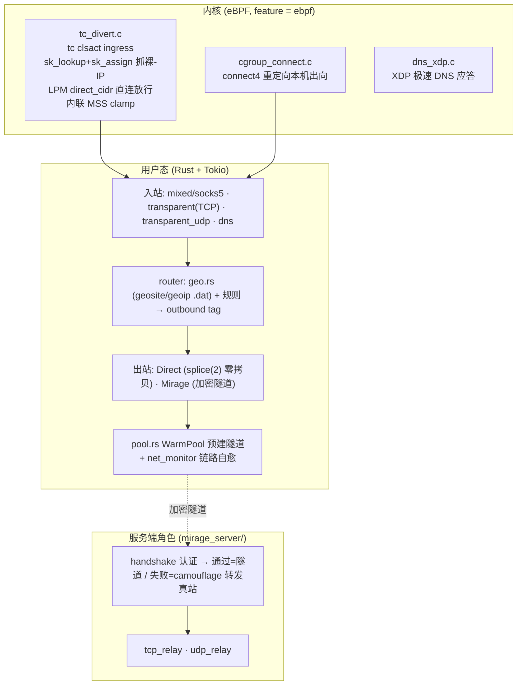

# System architecture

Mirage-rs 是**单二进制、双角色**(客户端/网关 与 服务端由同一 binary + config 决定)的抗审查代理引擎。
数据面在用户态(Tokio 异步),eBPF 只负责**流量拦截与内核旁路**,不做线速转发。

## 分层

## 模块边界

| 目录 | 职责 |
|---|---|
| `ebpf-src/*.c` + `src/ebpf/` | eBPF 程序与其 Rust 控制面(加载/attach/灌 map/热重载) |
| `src/proxy/` | 入站(mixed/socks5/transparent/transparent_udp)、出站、隧道、连接池、splice |
| `src/proxy/mirage_server/` | 服务端角色:握手认证、伪装转发、TCP/UDP 中继 |
| `src/crypto/` | `tls_raw`(ClientHello 字节级仿真)、`aead`(ChaCha20-Poly1305 分帧)、`hello_auth`(令牌) |
| `src/dns/` | DNS 服务、fake-IP 分配与反查 |
| `src/router/` | geo 分流(v2ray geosite/geoip `.dat` 解析) |
| `src/api/` | Axum Web 看板 + REST |

## 关键不变式

- eBPF 职责**刻意收窄**:只做拦截/重定向,数据搬运在用户态。理由见 [[ebpf-scope-narrowed]]。
- 直连快路径走 `splice(2)`,不经用户态缓冲。见 [[splice-over-sockmap]]。
- 透明路径当前 **IPv4-only**,靠 DNS 层 AAAA 抑制避免泄漏。见 [[ipv6-v4only-tradeoff]]。
