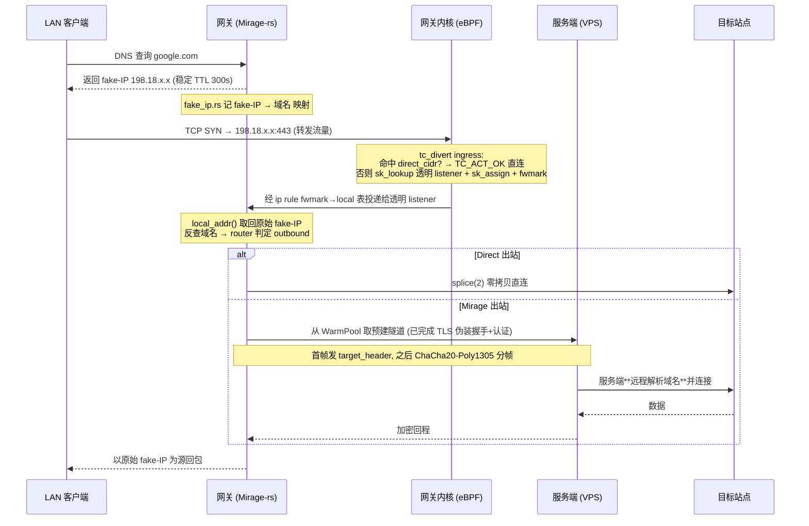

# Key flows

一条典型请求:LAN 客户端访问被代理域名(透明网关部署形态)。

## 要点

- **fake-IP 的意义**:客户端永远拿不到真实 IP,域名随隧道送到服务端**远程解析** —— 不信任本地/墙内 DNS。见 [[fakeip-remote-resolution]]。
- **首 SYN 与已建流走不同分支**:只对首 SYN `sk_assign`,已建流仅打 fwmark。这是踩出来的,见 [[syn-only-sk-assign]]。
- **认证失败不报错**:服务端把连接**转发到真实伪装站**,探针看到的是真站响应。见 [[camouflage-forward-on-auth-fail]]。
- **UDP(QUIC/游戏)**同样经 `tc_divert` → `transparent_udp`,per-flow 决策,Mirage 腿封帧走隧道。
