# Roadmap

> **用户确认 (2026-07-21)**: 方向大致对, 但**当前无固定计划 / 无承诺时间表** —— 走一步看一步,
> 哪个撞到痛点就修哪个。下表是"候选池"而非排期; 时间轴仅表示相对顺序。

## 已完成的主线(截至 v0.6.0-alpha.4)

- 透明网关整链路真机跑通(TCP + UDP + 隧道 + 回源)
- 抗识别:三套 ClientHello profile 轮换 + JA4 对照 harness + 同 ASN 伪装域名工具(`--prefix` 按掩码扩大)
- MSS clamp、链路自愈(netlink 变更过滤)、DNS 抗风暴、日志滚动
- **轻量模式** `lite-server`/`lite-client`(SOCKS5 全部转发, 仅 TCP), 服务名 `mirage-rs-lite-*` 与完整版区分
- **中转站**: 服务端接 Shadowsocks 上游(SIP004 + SIP022 全部加密方式; UDP 默认 block)
- **配置工具链**: `check`(重启前闸门)/ `format` / `import`; 启动时配置校验(未知字段 + 引用完整性)
- **入站认证**: SOCKS5(RFC 1929)/ HTTP(Basic), 修默认开放代理
- **易用性/发布**: install.sh 支持轻量模式与 SS 上游、密码 JSON 转义、版本/文档同步流程

## 候选池(无排期)

```mermaid
gantt
    dateFormat X
    axisFormat %s
    section 抗识别
    TLS resumption (破坏性协议变更)     :0, 3
    Chrome profile 保鲜 (需重新抓包)     :0, 1
    section 透明代理
    ICMP 处理 (ping 被代理域名不通)      :0, 2
    IPv6 全栈 (tc_divert/listener/geoip) :3, 4
    section 生态/协议
    SS 上游 UDP (SIP022 UDP 包格式)      :0, 2
    订阅链接 (格式待定义)                :0, 2
    section 工程债
    orphan 验证器接回 CI                 :0, 1
    清理死代码 mss_clamp.elf             :0, 1
```

| 项 | 性质 | 备注 |
|---|---|---|
| TLS resumption | 破坏性协议变更 | 零会话复用是真实统计指纹;工装已就绪,两端需同时升级。见 [[tls-fingerprint-mimicry]] |
| ICMP 处理 | 体验缺口 | ping/traceroute 被代理域名不通。**失败形态未在真机确认, 用户明确说等部署网关时再定** |
| IPv6 全栈 | 结构性 | 见 [[ipv6-v4only-tradeoff]] |
| SS 上游 UDP | 生态 | 需求驱动: 多数 SS 服务器默认不开 UDP 且无握手, 实现了不等于能用。见 [[ss-upstream-relay]] |
| 订阅链接 | 生态 | 基础已有(node_uri + import), 但**订阅格式本身要先定义**才动手 |
| process_name 分流 | 路由维度 | sing-box 有, 这里没有; 需 eBPF/procfs 支撑。见 [[routing-rules]] |
| orphan 验证器接回 CI / 死代码清理 | 工程债 | 见 [[orphan-filter-blackhole]] |
