# Roadmap

> ⚠️ **本页为低置信草稿**:项目**没有**成文的里程碑或时间表,以下是从 `docs/landscape-analysis.md`
> 的优先级表、代码中的已知缺口、以及近期提交方向**推断**出的待办,**不是**用户确认过的计划。
> 时间轴仅表示相对顺序,不代表承诺日期。

## 已完成的主线(截至 v0.6.0-alpha.1)

- 透明网关整链路真机跑通(TCP + UDP + 隧道 + 回源)
- 抗识别:三套 ClientHello profile 轮换 + JA4 对照 harness + 同 ASN 伪装域名工具(已并入 `install.sh`)
- MSS clamp、链路自愈(netlink)、DNS 抗风暴、日志滚动

## 推断中的待办

```mermaid
gantt
    dateFormat X
    axisFormat %s
    section 抗识别
    TLS resumption (破坏性协议变更)     :0, 3
    Chrome profile 保鲜 (需重新抓包)     :0, 1
    section 透明代理
    ICMP 处理 (ping 被代理域名不通)      :0, 2
    IPv6 全栈 (tc_divert/listener/geoip) :3, 4
    section 工程债
    orphan 验证器接回 CI                 :0, 1
    清理死代码 mss_clamp.elf             :0, 1
```

| 项 | 性质 | 备注 |
|---|---|---|
| TLS resumption | 破坏性协议变更 | 零会话复用是真实统计指纹;工装已就绪,两端需同时升级。见 [[tls-fingerprint-mimicry]] |
| ICMP 处理 | 体验缺口 | ping/traceroute 被代理域名不通(fake-IP 无主机且 ICMP 不分流)。**失败形态未在真机确认** |
| IPv6 全栈 | 结构性 | 见 [[ipv6-v4only-tradeoff]] |
| orphan 验证器接回 CI | 工程债 | 见 [[orphan-filter-blackhole]] |
| 死代码清理 | 卫生 | `mss_clamp.c/.elf` 已被 [[mss-clamp-merged-into-tc-divert]] 取代但仍在编译 |
